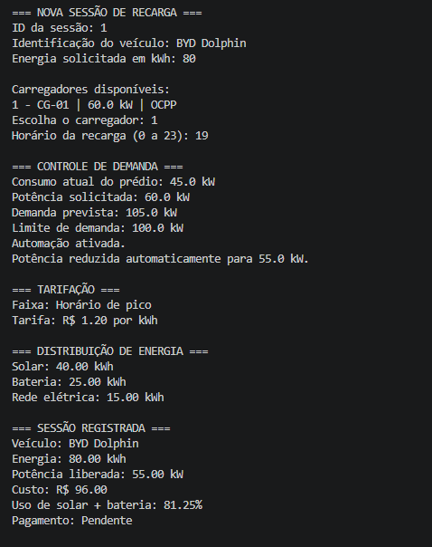

# ChargeGrid Intelligence

## GoodWe Challenge - Sprint 3
### Prototipagem Funcional e Integração

## Integrantes

- Gustavo Naville Tobara — RM570674
- Guilherme Marques dos Santos — RM573112
- Guilherme Wadt de Oliveira — RM569375
- Pedro Henrique Silva Santos — RM571537

## Sobre o Projeto

O ChargeGrid Intelligence é uma proposta de sistema inteligente para gerenciamento de estações de recarga de veículos elétricos em ambientes comerciais.

O projeto foi desenvolvido com base no desafio da GoodWe, buscando integrar energia renovável, automação, controle de demanda, tarifação, comunicação entre dispositivos e otimização inteligente.

## Objetivo

O objetivo do protótipo é simular o funcionamento integrado de uma estação comercial de recarga de veículos elétricos.

O sistema permite:

- Gerenciar sessões de recarga
- Controlar a demanda de energia
- Priorizar o uso de energia solar
- Utilizar energia armazenada em bateria
- Utilizar a rede elétrica quando necessário
- Calcular tarifas de recarga
- Simular pagamentos
- Integrar diferentes carregadores
- Gerar relatórios de consumo
- Aplicar regras de otimização inteligente

## Pilares do ChargeGrid

O projeto considera os quatro principais pilares estudados durante o GoodWe Challenge.

### 1. Controle de Demanda

O sistema verifica o consumo atual do estabelecimento antes de liberar uma nova recarga.

Caso a demanda ultrapasse o limite configurado, a potência do carregador pode ser reduzida automaticamente.

Na simulação realizada, o prédio apresentava consumo de 45 kW e o carregador solicitava 60 kW.

A demanda prevista seria de 105 kW, acima do limite de 100 kW. O sistema então reduziu automaticamente a potência do carregador para 55 kW.

### 2. Protocolos Abertos

O protótipo simula a integração de carregadores utilizando protocolos e tecnologias como:

- OCPP
- MQTT
- API REST

Esses padrões representam diferentes formas de comunicação entre carregadores, sistemas de gerenciamento e serviços externos.

### 3. Tarifação e Pagamento

O sistema calcula o custo da recarga considerando a quantidade de energia utilizada e o horário da sessão.

Na simulação, são consideradas duas tarifas:

- Fora do horário de pico: R$ 0,75 por kWh
- Horário de pico: R$ 1,20 por kWh

Também é possível simular métodos de pagamento como:

- PIX
- Cartão
- Aplicativo

### 4. Otimização Inteligente

O sistema analisa informações como:

- Consumo atual do estabelecimento
- Limite de demanda
- Disponibilidade de energia solar
- Energia armazenada na bateria
- Estado geral do sistema

Com base nesses dados, o sistema pode apresentar recomendações como:

- Reduzir a potência dos carregadores
- Priorizar energia solar
- Preservar a bateria
- Adiar sessões não prioritárias
- Evitar situações de alta demanda

O módulo de otimização utilizado neste protótipo é baseado em regras de decisão.

## Sustentabilidade e Eficiência Energética

O ChargeGrid Intelligence busca reduzir a dependência da rede elétrica e aumentar o aproveitamento de fontes renováveis.

A prioridade de utilização de energia é:

1. Energia solar
2. Energia armazenada em bateria
3. Rede elétrica

Essa estratégia permite aproveitar primeiro os recursos energéticos disponíveis localmente e utilizar a rede elétrica apenas quando necessário.

## Tecnologias Utilizadas

- Python
- GitHub
- Programação Orientada a Objetos
- Estruturas de dados
- Estruturas condicionais
- Automação baseada em regras
- Simulação de energia renovável
- Simulação de protocolos de comunicação
- Arquivos CSV
- Diagramas Mermaid

## Estrutura do Projeto

```text
ChargeGrid-Intelligence-Sprint3/
│
├── README.md
│
├── src/
│   └── chargegrid.py
│
├── diagramas/
│   ├── README.md
│   ├── arquitetura.md
│   └── fluxograma.md
│
├── dados/
│   └── sessoes_recarga.csv
│
└── imagens/
    ├── README.md
    ├── controle_demanda.png
    ├── pagamento_otimizacao_status.png
    └── relatorio_chargegrid.png
```

## Funcionamento do Protótipo

O programa apresenta um menu com as seguintes opções:

```text
1 - Cadastrar carregador
2 - Nova sessão de recarga
3 - Realizar pagamento
4 - Otimização inteligente
5 - Status do sistema
6 - Relatório
7 - Encerrar
```

### Cadastro de Carregador

O usuário pode cadastrar um carregador informando:

- Identificação
- Potência em kW
- Protocolo de comunicação

Os protocolos simulados são:

- OCPP
- MQTT
- API REST

### Nova Sessão de Recarga

Na nova sessão são informados:

- ID da sessão
- Identificação do veículo
- Energia solicitada
- Carregador escolhido
- Horário da recarga

Antes da recarga, o sistema verifica automaticamente se a potência solicitada ultrapassa o limite de demanda do estabelecimento.

### Distribuição de Energia

A energia necessária para a recarga é distribuída automaticamente.

Primeiro é utilizada a energia solar disponível.

Depois é utilizada a energia armazenada na bateria.

Caso ainda seja necessário, o restante da energia é fornecido pela rede elétrica.

### Tarifação

O horário informado é utilizado para definir a tarifa da sessão.

Horários entre 18h e 21h são considerados horários de pico na simulação.

### Pagamento

Após a sessão, o pagamento pode ser simulado utilizando:

- PIX
- Cartão
- Aplicativo

## Demonstração do Protótipo

### Controle Automático de Demanda

Durante a demonstração:

- Consumo do prédio: 45 kW
- Potência solicitada pelo carregador: 60 kW
- Demanda prevista: 105 kW
- Limite configurado: 100 kW

Como a demanda ultrapassaria o limite, o ChargeGrid Intelligence reduziu automaticamente a potência para 55 kW.



### Pagamento, Otimização e Status

O sistema realizou o pagamento da sessão por PIX.

Também foi executado o módulo de otimização inteligente, que analisou as condições energéticas e apresentou recomendações.

O status do ChargeGrid também permite acompanhar informações como limite de demanda, consumo do prédio, energia disponível e quantidade de sessões.


### Relatório Final

O sistema gera um relatório com os resultados das sessões de recarga.


## Resultados da Simulação

Na principal demonstração realizada foram obtidos os seguintes resultados:

- Veículo: BYD Dolphin
- Carregador: CG-01
- Protocolo: OCPP
- Energia total solicitada: 80 kWh
- Energia solar utilizada: 40 kWh
- Energia da bateria utilizada: 25 kWh
- Energia da rede elétrica: 15 kWh
- Participação de solar + bateria: 81,25%
- Horário da recarga: 19h
- Tarifa aplicada: R$ 1,20 por kWh
- Custo simulado: R$ 96,00
- Pagamento: Pago
- Forma de pagamento utilizada: PIX
- Demanda prevista antes da automação: 105 kW
- Potência liberada após controle de demanda: 55 kW

Os resultados demonstram a atuação integrada entre controle de demanda, fontes de energia, carregadores, tarifação, pagamento e monitoramento.

## Arquitetura do Sistema

A arquitetura do ChargeGrid Intelligence está documentada no arquivo:

```text
diagramas/arquitetura.md
```

O diagrama apresenta a integração entre:

- Energia solar
- Bateria
- Rede elétrica
- ChargeGrid Intelligence
- Controle de demanda
- Otimização
- Carregadores
- Veículos elétricos
- Tarifação
- Pagamento
- Relatórios

## Fluxograma de Funcionamento

O fluxo completo de uma sessão de recarga está disponível em:

```text
diagramas/fluxograma.md
```

O fluxograma representa desde a solicitação de uma nova recarga até o registro dos dados e geração do relatório.

## Dados Funcionais

O projeto também possui um conjunto de dados simulados de sessões de recarga.

Arquivo:

```text
dados/sessoes_recarga.csv
```

O arquivo apresenta informações como:

- ID da sessão
- Veículo
- Carregador
- Protocolo
- Horário
- Energia consumida
- Potência
- Tarifa
- Energia solar
- Energia da bateria
- Energia da rede
- Custo
- Status de pagamento

## Como Executar

É necessário possuir Python instalado no computador.

Abra um terminal na pasta principal do projeto e execute:

```bash
python src/chargegrid.py
```

Em alguns sistemas também pode ser utilizado:

```bash
python3 src/chargegrid.py
```

Depois disso, o menu principal do ChargeGrid Intelligence será exibido no terminal.

## Exemplo de Teste

Uma demonstração pode ser realizada utilizando os seguintes dados.

### Carregador

```text
ID: CG-01
Potência: 60 kW
Protocolo: OCPP
```

### Sessão

```text
ID da sessão: 1
Veículo: BYD Dolphin
Energia solicitada: 80 kWh
Carregador: CG-01
Horário: 19h
```

Com esses valores, a demanda prevista chega a 105 kW.

Como o limite é de 100 kW, o sistema reduz automaticamente a potência do carregador para 55 kW.

## Justificativa Técnica

O Python foi utilizado por permitir uma implementação simples e clara da lógica do protótipo.

A Programação Orientada a Objetos permite representar elementos do sistema, como carregadores e sessões de recarga.

As estruturas condicionais são responsáveis pelas decisões automáticas, como:

- Controle de demanda
- Escolha das fontes de energia
- Definição da tarifa
- Recomendações de otimização

O uso de arquivos CSV permite apresentar dados simulados de forma organizada.

Os diagramas Mermaid ajudam a representar visualmente a arquitetura e o fluxo do sistema.

## Conexão com a Disciplina

O projeto utiliza conceitos trabalhados na disciplina, incluindo:

- Lógica de programação
- Estruturas condicionais
- Estruturas de dados
- Programação Orientada a Objetos
- Modularização
- Automação
- Pensamento computacional
- Organização e análise de dados

O protótipo transforma os problemas identificados nas etapas anteriores do GoodWe Challenge em uma solução funcional simulada.

## Conclusão

O ChargeGrid Intelligence demonstra uma proposta de gerenciamento inteligente para estações comerciais de recarga de veículos elétricos.

O protótipo integra controle de demanda, energia solar, armazenamento em bateria, rede elétrica, protocolos de comunicação, tarifação, pagamentos e otimização baseada em regras.

A solução demonstra como automação e gerenciamento energético podem contribuir para reduzir picos de consumo, aumentar o aproveitamento de energia renovável e melhorar a eficiência das operações de recarga.
