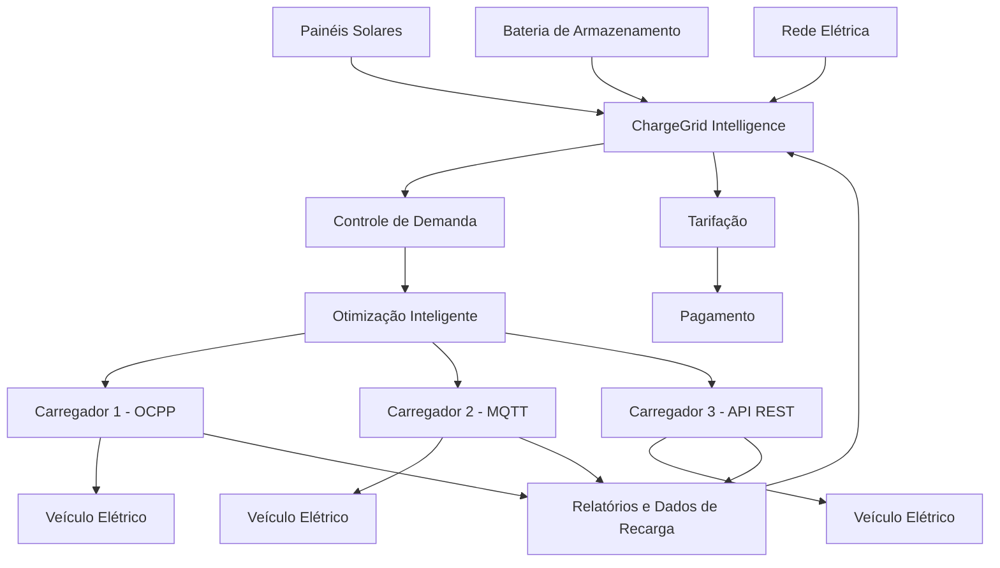

# Arquitetura do ChargeGrid Intelligence

O diagrama abaixo representa a integração dos principais componentes do protótipo.

## Funcionamento

O ChargeGrid Intelligence recebe energia de diferentes fontes e gerencia sua utilização de forma automatizada.

A prioridade do sistema é utilizar fontes mais eficientes e sustentáveis, considerando:

1. Energia solar disponível
2. Energia armazenada na bateria
3. Rede elétrica

O controle de demanda verifica a potência disponível antes de permitir uma nova recarga.

O módulo de otimização analisa as condições do sistema e define como os carregadores devem operar.

Os carregadores simulam comunicação por protocolos como OCPP, MQTT e API REST.

As sessões de recarga geram informações utilizadas nos módulos de tarifação, pagamento e relatórios.
