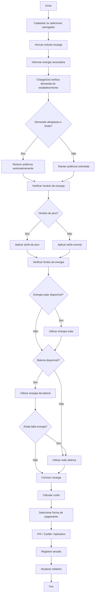

# Fluxograma de Funcionamento do ChargeGrid

Este fluxograma mostra o processo de uma sessão de recarga no protótipo ChargeGrid Intelligence.

## Resumo do Processo

O ChargeGrid realiza as seguintes etapas:

1. Identifica o carregador utilizado.
2. Recebe a solicitação de energia do veículo.
3. Verifica o limite de demanda do estabelecimento.
4. Reduz a potência automaticamente caso seja necessário.
5. Define a tarifa de acordo com o horário.
6. Prioriza energia solar.
7. Utiliza a bateria quando necessário.
8. Utiliza a rede elétrica como fonte complementar.
9. Calcula o custo da sessão.
10. Simula o pagamento.
11. Registra os dados para geração de relatórios.
